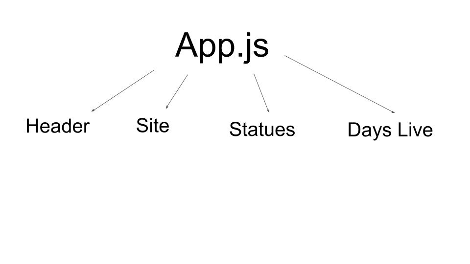

# Webpage Status
## Jimmy Zebroski, Theary Im

## Description A web application used to check the status of websites made by eventcore.

## Specification
 ## Admin
  * > Must sign in to use admin page.
  * > Can add urls to the site.
  * > Can enter email for someone to be notified if site goes down.
 ## Normal User
 * > Can see status of all webpages enterd.
 * > Can see number of days the sites been live or since last time down.

 ##  Component Structure
  

 ### Languages/Libararies Used
 * HTML
 * Javascript
 * React
 * C#

## Environment Configuration
The Eventcore monitoring service uses a Configuration API hosted alongside the Telemetry API to provide shared
configuration for the Website application as well as the Synthetic Transaction Service. The following documentation
provides guidance on configuring the environment.

**Synthetic Transaction Service**  
The following configuration settings are used to configure the Synthetic Transaction Service host executable. These
settings are placed in an 'appSettings.json' file alongside the executable.

``` json
{
  "Logging": {
    "LogLevel": {
      "Default": "Warning"
    }
  },
  "AllowedHosts": "*",
  "ConfigurationEnvironment": "test",
  "ConfigurationApiUrl": "http://localhost:5000/api/configuration",
  "TelemetryApiUrl": "http://localhost:5000/api/telemetry"
}
```

**Test Environment**  
The following JSON content is the configuration settings for the synthetic transactions in the Test environment:

```json
{
  "Id": "test",
  "SyntheticTransactions": {
    "WebsiteAvailability": {
	  "RunInterval": "00:01:00",
      "SiteUrls": [
        "https://www.eventcore.com",
        "https://www.google.com"
      ]
    }
  }
}
```

## Installation on Windows

**Install the API**  
To install the Telemetry API service use the following instructions:

Open a command prompt (run as administrator) and run the following command-line tool to install the Telemetry
API as a service on the Windows operating system. To see the list of services, right-click the 'Start' button, 
select 'Run' and then type if 'Services.msc'.  

To Be Continued...


